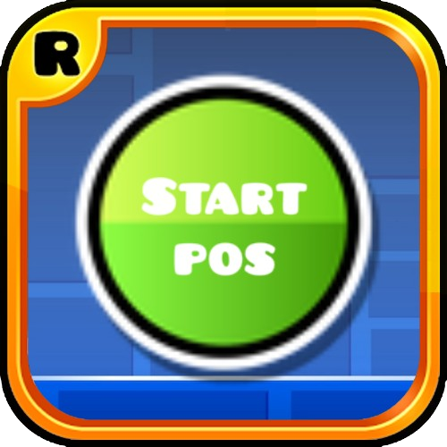

# PositionSwitch
Mod for accessing StartPos copies of levels.



*Update logo.png to change your mod's icon (please)*

## Build instructions
For more info, see [the Geode docs](https://docs.geode-sdk.org/getting-started/create-mod#build)
```sh
# Assuming you have the Geode CLI set up already
geode build
```

# Credits
- The PositionSwitch owner for allowing me to use the spreadsheet in this mod
- The [spreadsheet](https://docs.google.com/spreadsheets/d/11J28JcremydDAi6vIcQwKTNa9nfRis8O4soxE7_X5qc/edit?pli=1&gid=0#gid=0) itself
